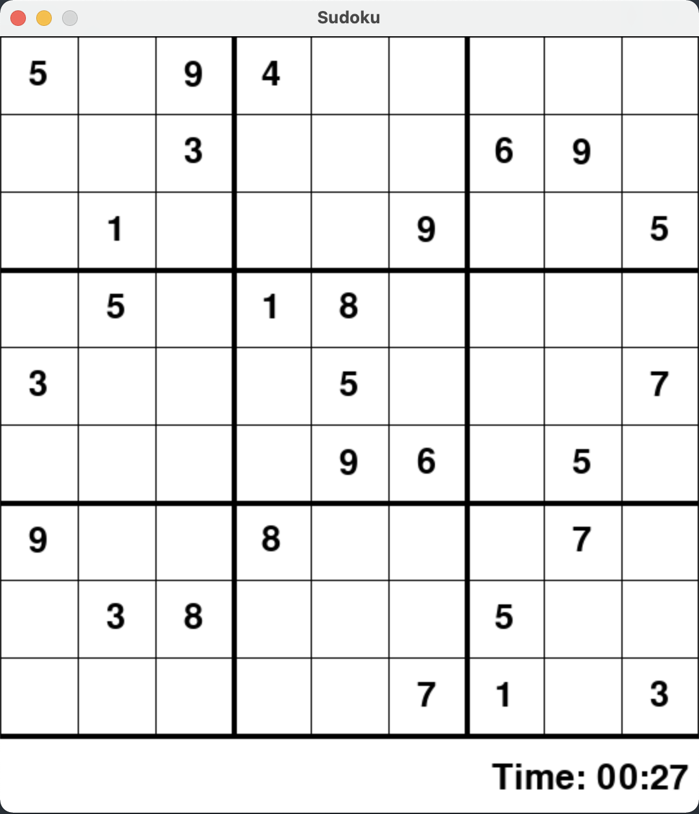

# Sudoku Solver ✏️
Sudoku puzzle solver using recursion. &nbsp;
Includes a text version and a GUI version using Pygame.

# Guide to Sudoku GUI 📘
- Click a box and input a number to pencil in your choice.
- To confirm your number, click [ENTER].
- To delete a pencil in, click [DELETE] or [BACKSPACE].
- Finally, if you would like the board to be solved, click [SPACE].

# Installation
To install Pygame, use the following command: &nbsp;
python3 -m pip install -U pygame --user &nbsp;
To see if it works, run one of the included examples: &nbsp;
python3 -m pygame.examples.aliens
